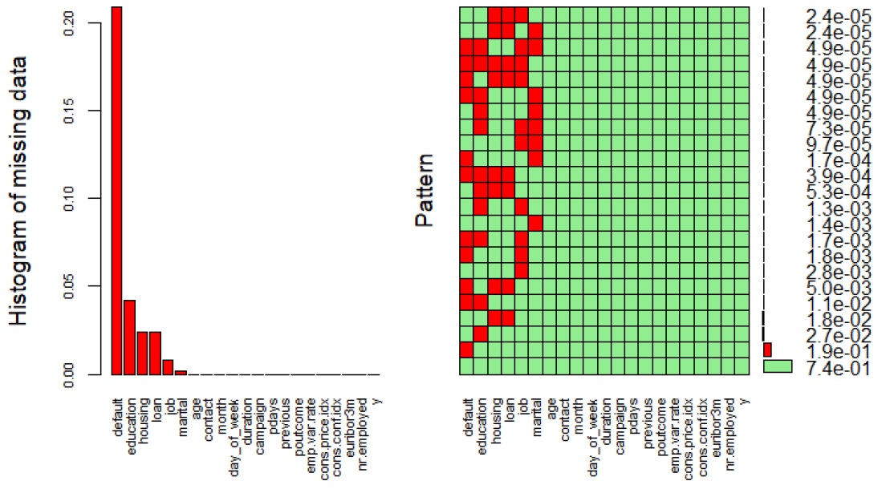

# BankMarketing-
Given a dataset related to marketing campaign, investigate which ML model predicts better if a client will subscribe a term deposit.


## Summary

  - [Description of the problem](#description-of-the-problem)
  - [Description of the repository](#description-of-the-repository)
  - [Requirements](#requirements)
  - [Usage](#usage)
  - [Results](#results)
  - [Acknowledgments](#acknowledgments)

## Description of the problem

Given this dataset https://archive.ics.uci.edu/ml/datasets/bank+marketing#, we are essentially being asked to identify which customers will agree to open a time account in a bank marketing campaign.

I am following the procedure below: 
  
  Step 1. Explore the data and do whatever kind of cleaning / normalization I think necessary.
  
  Step 2. I choose at least three classification techniques (Trees, Bayesian, k-NN or something else from the literature and select features and parameters for each model.
  
  Step 3. I apply three grouping techniques without using the class. I investigate if I can you create groups with the other variables, which will contain a large number of records of only one class? Then examine if each cluster gets the label of the majority class and new data comes in, will it be sorted correctly?
  
  Step 4. I evaluate all models based on Accuracy, Precision, Recall and F-measure and construct the confusion table for each model.
  
  Step 5. Finally, I choose the best model, justifying my choice.
  
  
## Description of the repository

```
    .
    ├── DECISION_TREES_Final.R                 #
    ├── KNN_final.R                            #
    ├── NAIVE_BAYES_Final.R                    #
    ├── SVM_Final.R                            #
    ├── data_exploration.R                     #
    ├── data_feature_selection_reduction.R     #
    ├── data_preparation.R                     #
    ├── dbscan_CleanedData.R                   #
    ├── draw_confusion_matrix.R                #
    ├── hierarchical_CleanedData.R             #
    ├── kmeans_CleanedData.R                   #
    ├── multiplot.R                            #
    ├── plot_characteristics_by_y.R            #
    └── plot_characteristics_hist.R            #

```

## Requirements
    R = 3.5.1
    
   and the following libraries
   
    library(rpart)
    library(rpart.plot)
    library(mice)
    library(VIM)
    library(gdata)
    library(plyr)
    library(dplyr)
    library(ggplot2)
    library(FSelector)
    library(e1071)
    library(caret)
    library(pander)
    library(class)
    library(MLmetrics)
    library(mlbench)
    library(klaR)
    library(class)
    library(ROCR)
    library(cluster)
    library(factoextra)
    library(NbClust)
    library(pracma)
    library(mixtools)
    library(dbscan)
    library(DataExplorer)


## Usage
An example for running the method is :

    run .R files in RStudio

## Results

### for step 1
I explore for missing values as shown in the image below


and I decide to keep unknown values as a seperate category (after data imputation failed)

Additionaly, for data exploration I have created 2 functions (using ggplot) where they print some graphs for our data. These are plot_characteristics_hist.R (save in working directory) and plot_characteristics_by_y.R. The first prints histogram and density plots, while the second shows us for each column, the yes and no ratio it has. Indicatively I show 2 images from each.


### for step 3

I chose trees, kNN and SVM as classification techniques.
The following images shows the confusion matrix and the corresponding metrics for trees:


The following images shows the confusion matrix and the corresponding metrics for kNN:


The following images shows the confusion matrix and the corresponding metrics for SVM (with balancing the trainset with ROSE):


    
### for step 4
I chose Kmeans, hierarchical single and DBSCAN as unsupervised techniques.
The following images shows the confusion matrix and the corresponding metrics for Kmeans:


The following images shows the confusion matrix and the corresponding metrics for hierarchical single:


The following images shows the confusion matrix and the corresponding metrics for DBSCAN:


### for step 5- Final conclusion

As concluded from the above, the best method of supervised learning is SVM and for unsupervised is hierarchical single.

## Acknowledgments
https://archive.ics.uci.edu/ml/datasets/bank+marketing#

R book from issel
    
